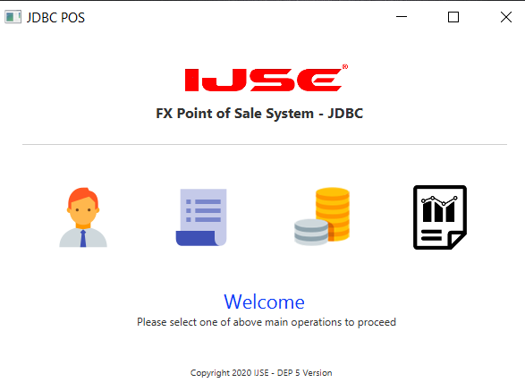
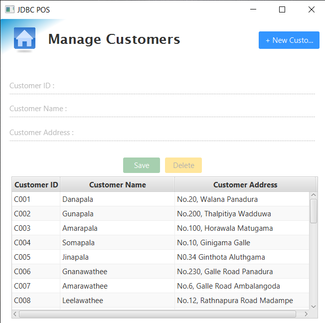
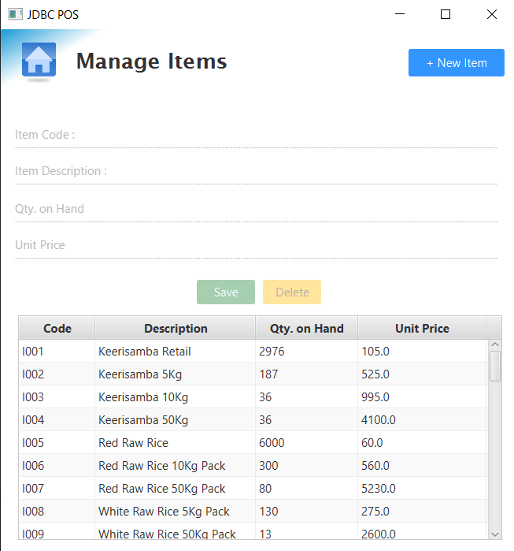
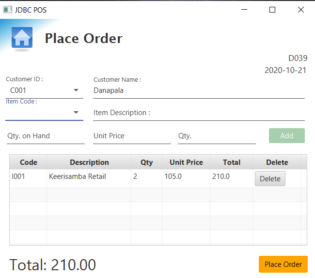
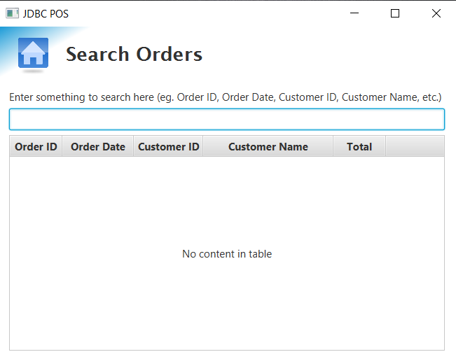

# Point of Sales System [Layered Architecture]
> Project represent Point of Sales System using Layered Architecture

## Introduction

This application is simple Library Management system with following functionalities,
         Manage customers
         Manage items
         Place orders
         View orders
         Search order

## Requirements

Before use this application you must need to install JAVA runtime environment and MYSQL database management services..
links :
    [JAVA](https://www.oracle.com/technetwork/java/javase/downloads/jdk8-downloads-2133151.html) ,
    [MySQL](https://www.mysql.com/)

## Technologies
> JAVA FX | 
> JDBC

## Used Design Patterns
> Singleton design pattern |
> Factory design pattern |
> Strategy design pattern |
> Adaptor design pattern |
> Facade design pattern |
> DAO design pattern

## Installation

If you did above installations, You only have to double click the jar file and install the jar file.

POS with Maven
* [POS with Layered-Maven](https://github.com/poornimavithanage/pos-system-layered-maven)
* [POS with Layered-[Hibernate-Maven]](https://github.com/poornimavithanage/POS-Layered-Hibernate-Maven)
* [POS with Layered-[JPA Hibernate-Maven]](https://github.com/poornimavithanage/POS-Layered-JPA-Maven)
* [POS with Layered-[Hibernate-Spring-Maven]](https://github.com/poornimavithanage/POS-Integration-Hibernate-with-Spring)
* [POS with Layered-[JPA Hibernate-Spring-Maven]](https://github.com/poornimavithanage/POS-Integration-JPA-with-Sring-Maven)
* [POS with Layered-[Spring knows Hibernate Maven]](https://github.com/poornimavithanage/POS-Spring-Hibernate-Maven)
* [POS with Layered-[Spring knows JPA Maven]](https://github.com/poornimavithanage/POS-System-layered-spring-JPA-Maven)
* [POS with Layered-[Spring Data JPA Maven]](https://github.com/poornimavithanage/POS-system-spring-data-jpa-maven)

## Author

name  : Poornima Vithanage

e-mail : vithanagepurnima@gmail.com

[Github] (https://github.com/poornimavithanage)

## Dashboard

## Manage Customer

## Manage Items

## Manage Place Orders

## Manage Search Order

## Installation

* jfoenix-8.0.8.jar
* mysql-connector-java-8.0.20.jar

## License

This project is license under the MIT License - see the [LICENSE.txt](LICENSE.txt) file for details.

